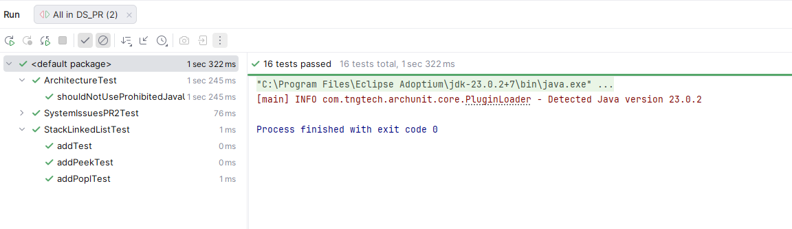

# PR2 - System Issues Management

## Author
- name: **A. César Flores Carrera**
- e-mail: **afloresca@uoc.edu**

## Solution

This document explains the solution for PR2, implemented in the following classes
- [SystemIssuesPR2Impl.java](#SystemIssuesPR2Impljava) that is an implementation of [SystemIssues.java](#SystemIssuesjava)
- [SystemIssuesHelperImpl.java](#SystemIssuesHelperImpljava)

And in all the new classes in the following packages
- [uoc.ds.pr.pr2.adt.sequential](#uocdsprpr2adtsequential-Package)
  - **StackLinkedList.java**
- [uoc.ds.pr.model](#uocdsprmodel-Package)
- [uoc.ds.pr.exceptions](#uocdsprexceptions-Package)

New test class and the final tests result can be found [at the end of this document](#tests-results)

## Project Structure

Main source code is located under `src/main/java/uoc/ds/pr/` and is divided into these packages:

- `uoc.ds.pr.pr2`: public API and the main implementation of the PR2 assignment
- `uoc.ds.pr.pr2.adt.sequential`: custom stack implementation used by workers
- `uoc.ds.pr.model`: domain entities
- `uoc.ds.pr.exceptions`: custom checked exceptions used by the API

Test code is located under `src/test/java/uoc/ds/pr/` and validates both behavior and architectural constraints.

## Implementation

The implementation uses:

- fixed-size arrays for workers, systems, and components
- linked lists for variable-size collections
- a custom LIFO stack for issue assignment

## `uoc.ds.pr.model` Package

This package contains the domain entities used by the system.

### `Worker.java`

Represents a technician.

Fields:

- `id`
- `name`
- `address`
- `StackLinkedList<Issue> issues`
- `LinkedList<Issue> completedIssues`

Meaning:

- `issues` stores assigned pending work in LIFO order
- `completedIssues` stores solved issues in completion order

### `System.java`

Represents a managed system.

Fields:

- `id`
- `description`
- `location`
- `LinkedList<Component> components`

Important method:

- `isSystemComponent(String componentId)` checks whether a given component id is already installed

### `Component.java`

Represents a hardware or software component.

Fields:

- `id`
- `trademark`
- `model`
- `serial`
- `LinkedList<Issue> issues`

Meaning:

- each component keeps track of all issues reported against it

### `Issue.java`

Represents a reported incident.

Fields:

- `id`
- `description`
- `LocalDateTime dateTime`
- `boolean resolved`
- `Worker worker`

Important methods:

- `resolve()` marks the issue as solved
- `setWorker(Worker worker)` stores the assigned technician

## `uoc.ds.pr.pr2.adt.sequential` Package

This new package contains the **custom stack implementation** required by the assignment.

### `StackLinkedList.java`

`StackLinkedList<E>` extends DSLib `LinkedList<E>` and implements DSLib `Stack<E>`.

Supported operations:

- `push(E e)`: inserts at the beginning
- `pop()`: removes the first element
- `peek()`: returns the element referenced by `top`
- `isEmpty()`
- `size()`
- `values()`

This class

- will return assigned issues that must be solved in LIFO order
- provides that behavior without using `java.util.Stack`

## `uoc.ds.pr.exceptions` Package

This package contains the checked exceptions used to enforce API preconditions and invalid states.

### `DSException.java`

Base exception for the project. All domain-specific exceptions inherit from it.

### Specialized Exceptions

- `ComponentAlreadyInstalledException`
- `ComponentNotFoundException`
- `IssueAlreadyAssignedException`
- `IssueAlreadyResolvedException`
- `IssueNotFoundException`
- `NoIssuesException`
- `NoSystemsException`
- `NoWorkerException`
- `SystemHasNoComponentsException`
- `WorkerNotFoundException`

## `uoc.ds.pr.pr2` Package

This package contains the main contract and implementation of the assignment.

### `SystemIssues.java`

This is the main ADT interface. It defines all operations the system must support:

- registering workers, systems, and components
- installing components into systems
- creating issues for components
- assigning issues to workers
- solving issues using LIFO order
- retrieving systems, system components, completed issues, and summary statistics

It also defines three capacity constants:

- `MAX_WORKERS = 35`
- `MAX_SYSTEMS = 150`
- `MAX_COMPONENTS = 110`

### `SystemIssuesPR2Impl.java`

This class is the core of the project. It implements all business operations declared in `SystemIssues`.

#### Internal State

`SystemIssuesPR2Impl` stores the application state in these fields:

- `Worker[] workers`
- `System[] systems`
- `Component[] components`
- `int workerIndex`, `systemIndex`, `componentIndex`
- `LinkedList<Issue> issues`
- `SystemIssuesHelperImpl systemIssuesHelper`

Design choice:

- workers, systems, and components are stored in arrays because their maximum size is known
- issues are stored in a linked list because the total number is variable
- the helper object receives references to the same arrays, so helper queries always see the current data

#### Main Methods

##### `addWorker(String workerId, String name, String address)`

Behavior:

- searches the worker array by id
- if the id does not exist, inserts a new `Worker` at `workerIndex`
- if the id already exists, it updates user's data and maintains its assigned and solved issues

##### `addSystem(String systemId, String description, String location)`

Behavior:

- searches the systems array by id
- inserts a new `System` if it is new
- updates a `System` data, except its components, if the id already exists

##### `addComponent(String componentId, String trademark, String model, String serial)`

Behavior:

- searches the components array by id
- inserts a new `Component` if needed
- update the existing component if the id already exists


##### `installComponentToSystem(String componentId, String systemId)`

Behavior:

- obtains the target `System` and `Component` through `SystemIssuesHelperImpl`
- checks whether the component id is already present in the system
- throws `ComponentAlreadyInstalledException` if it is duplicated
- otherwise appends the component to the system's linked list

Relationship managed here:

- `System -> LinkedList<Component>`

##### `createIssue(String issueId, String componentId, String description, LocalDateTime dateTime)`

Behavior:

- locates the component
- throws `ComponentNotFoundException` if the component does not exist
- creates a new `Issue`
- inserts the issue into the global issue list
- inserts the same issue into the component's issue list
- returns the created issue

Relationships managed here:

- global collection of issues
- `Component -> LinkedList<Issue>`

##### `assignIssue(String issueId, String workerId)`

Behavior:

- looks for the issue in the global issue list using `getIssueById`
- validates that the issue exists
- validates that the issue is not already assigned
- validates that the issue is not already resolved
- locates the worker
- pushes the issue onto the worker's stack
- sets the worker reference inside the issue

Relationships managed here:

- `Worker -> StackLinkedList<Issue>`
- `Issue -> Worker`

The stack behavior is important because issue solving is later done in reverse assignment order.

##### `solveIssue(String workerId)`

Behavior:

- locates the worker
- checks that the worker exists
- checks that the worker has at least one assigned issue
- pops the top issue from the worker stack
- marks the issue as resolved
- appends the issue to the worker's completed issue list
- returns the solved issue

Relationships managed here:

- removal from assigned issue stack
- insertion into `Worker.completedIssues`

This is where the LIFO behavior becomes visible.

##### `getSystems()`

Behavior:

- throws `NoSystemsException` if no systems have been registered
- otherwise returns an `IteratorArrayImpl<System>` over the active part of the systems array

##### `getComponentsBySystem(String systemId)`

Behavior:

- throws `SystemHasNoComponentsException` if there are no components registered at all
- otherwise returns the iterator of the selected system's component list

Implementation detail:

- the method checks `componentIndex == 0`, which is a global condition
- it does not specifically verify whether the selected system has zero installed components

##### `getDoneIssuesByWorker(String workerId)`

Behavior:

- throws `NoIssuesException` when the global issue list is empty
- otherwise returns the iterator for the worker's completed issues

Implementation detail:

- the method checks whether any issue exists globally, not whether the selected worker has completed issues

##### `getTopWorker()`

Behavior:

- throws `NoWorkerException` if no workers exist
- scans all workers
- returns the worker with the largest number of completed issues

Tie behavior:

- if two workers have the same number of completed issues, the first one found remains the result

##### `getSystemWithMostComponents()`

Behavior:

- throws `NoSystemsException` if no systems exist
- scans all systems
- returns the system with the largest component count

Tie behavior:

- if two systems have the same number of installed components, the first one found remains the result

#### Private Search Methods

`SystemIssuesPR2Impl` also includes helper search methods:

- `findWorkerIndex`
- `findSystemIndex`
- `findComponentIndex`
- `getIssueById`

Their role is to locate entities inside arrays or linked lists without using Java collection classes forbidden by the assignment.

### `SystemIssuesHelper.java`

It exposes some support operations.

- access entity by id
- count workers, systems, and components
- count components installed in a system
- count total issues
- count issues by component
- count issues assigned to a worker


### `SystemIssuesHelperImpl.java`

This class implements `SystemIssuesHelper` and acts as a query utility over the main arrays.

#### Constructor

```java
public SystemIssuesHelperImpl(Worker[] w, System[] s, Component[] c);
```

The constructor receives the same arrays owned by `SystemIssuesPR2Impl`. This means:

- it does not copy data
- it works over shared mutable state
- every query reflects the current contents of the arrays

#### Implemented Methods

##### `getWorker(String id)`

- scans the worker array linearly
- returns the matching worker or `null`

##### `numWorkers()`

- counts non-null entries in the worker array

##### `getSystem(String id)`

- scans the systems array linearly
- returns the matching system or `null`

##### `numSystems()`

- counts non-null entries in the systems array

##### `getComponent(String id)`

- scans the components array linearly
- returns the matching component or `null`

##### `numComponents()`

- counts non-null entries in the component array

##### `numComponentsBySystem(String systemId)`

- locates the system
- returns `system.getComponents().size()`

##### `numIssues()`

- iterates over all components
- accumulates the size of each component issue list

This means the total issue count is derived from component issue lists, not from the global `issues` list inside `SystemIssuesPR2Impl`.

##### `numIssuesByComponent(String componentId)`

- returns the size of the selected component's issue list

##### `numIssuesByWorker(String workerId)`

- returns the size of the selected worker's assignment stack


## Tests results
The project has run successfully all the tests


## New  Expanded Tests Class
### `SystemIssuesPR2TestExpanded`
 
#### 5 New tests has been added

- **getDoneIssuesByWorkerWithoutSolvedIssuesTest**
  - Try to get Done Issues from a worker without solved issues, returns empty iterator
- **updateWorkerDataTest**
  - creates a user, it assigns issues, updates user, the user data has been updated, the issues still remain
- **updateSystemDataTest**
  - creates a system, it assigns components, updates system, the system data has been updated, the components still remain
- **noTopWokerYet**
  - Tries to get the top Worker when there are no solved issues at all
- **noMostCompleteSystemYet**
  - Tries to get the most complete System when there is no component installed yet

